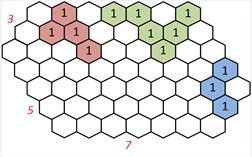

# TEST HEXAGONS # 

Реализовать интерфейс и логику средствами JavaScript, HTML, CSS (возможно использование фреймворков) по следующим требованиям - необходимо посчитать количество доменов в гексагональной решётке.
Ячейкам решётки м.б. присвоено значение 0 или 1. Если 2 ячейки, имеющие одинаковое значение, имеют общую грань, то они входят в один домен.
В решётке, изображённой на рисунке  можно определить 3 различных домена, отображённых на рисунке цветами. Подразумевается, что бесцветным ячейкам присвоено значение 0.

Предложить пользователю ввод размера односвязной гексагональной области ( L,N,M<=30 - три поля ввода с валидацией, на примере L=3, M=5, N=7). После ввода размера отобразить (по отдельной кнопке) на странице пустую гексагональную решётку заданного размера с возможностью ручного ввода значений в ячейки (изменение 0\1  и наоборот щелчком мыши на ячейке).

Программа должна определять количество доменов, ячейки которых имеют значение 1, в заданной решётке (кнопка «Посчитать домены») и выделить цветом ячейки, входящие в домен. Цвета разных доменов должны отличаться. Предусмотреть поле для вывода количества доменов.

Также реализовать автоматическое заполнение решётки по отдельной кнопке «АВТО» значениями 0 или 1 с предварительным указанием вероятности использования единицы (вероятность от 0,01 до 0,99) в отдельном поле ввода с валидацией. По нажатию кнопки «АВТО» также следует рассчитывать количество доменов и раскрашивать их.

После каждого автоматического заполнения и расчета количества доменов в полученной решётке добавлять строку в таблице (внизу страницы) следующего вида:

Вероятность | Количество доменов в решётке (всего | Из них неодносвязных) | Количество ячеек в решётке (L;N;M), из них имеющих значение 1            

Ограничить количество строк результата  в таблице значением 10. Т.е. при попытке вставить 11-ую строку стирается строка 1, происходит сдвиг строк вверх, данные записываются в последнюю строку.

